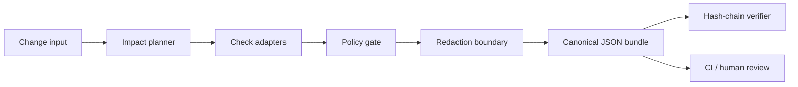

# ProofSmith

> **Turn a diff into evidence.**

ProofSmith is a deterministic, local-first verification harness for code changes produced by humans or AI coding agents. It maps the change surface to relevant checks, applies explicit policy gates, redacts sensitive evidence, and emits replayable JSON bundles with tamper-evident hashes.

[](https://github.com/Alqudimi/proofsmith/actions/workflows/ci.yml)
[](LICENSE)
[](pyproject.toml)

## Why ProofSmith exists

Modern code review increasingly depends on automated checks and AI-assisted changes, but a green command is not the same as a reviewable proof. Reviewers need to know which files were in scope, why a check ran, what artifact supports the result, and whether the evidence can be replayed without trusting a hosted service.

ProofSmith makes that contract explicit. It is not an LLM observability dashboard, a generic prompt evaluator, or a CI replacement. It is the evidence layer that turns a change into a bounded, inspectable verification decision.

## What it does today

| Capability | Current behavior |
|---|---|
| Git integration | Parses `git diff --numstat` safely, including binary files and path traversal rejection. |
| Impact planning | Maps Python, frontend, workflow, documentation, and security paths to deterministic checks. |
| Policy gates | Produces `pass`, `review`, `blocked`, or `skipped` with an actionable reason. |
| Evidence bundles | Writes schema-versioned JSON containing revision, files, checks, policy result, and hashes. |
| Redaction | Removes common API keys, tokens, passwords, and secret-shaped values before persistence. |
| Replay verification | Recomputes bundle hashes and validates ordered hash chains. |
| Local CLI | Runs without an API key or hosted service. |
| Web report | Shows the product model through a polished, accessible report interface. |

## Quick start

```bash
python -m venv .venv
source .venv/bin/activate
python -m pip install -e '.[test]'

proofsmith plan examples/verification-input.json
# Feed a real Git diff into the impact planner.
git diff --numstat HEAD~1..HEAD | proofsmith scan
proofsmith bundle examples/verification-input.json --output .proofsmith
proofsmith verify .proofsmith/*.json
```

The sample input is intentionally deterministic and safe to run offline. It produces a bundle similar to:

```json
{
  "schema_version": "proofsmith/v1",
  "final_status": "pass",
  "request": {"revision": "demo-commit-7f3a2c1"},
  "content_hash": "…"
}
```

## Architecture

The core is framework-independent Python. Domain models describe changes and evidence. The impact planner selects checks. The policy module evaluates the aggregate result. The bundle writer applies redaction and canonical hashing at the persistence boundary. The CLI is a thin adapter over those use cases.



The design keeps business rules independent from the web presentation and leaves clear extension points for Git adapters, sandbox runners, plugin checks, remote artifact stores, and signed attestations.

## Project layout

```text
src/proofsmith/
  models.py       # domain entities and statuses
  git_adapter.py  # safe Git numstat parser
  impact.py       # deterministic change-to-check planning
  policy.py       # explicit decision gates
  redaction.py    # evidence sanitization
  hashchain.py    # canonical hashing and replay verification
  bundle.py       # bundle creation and persistence
  cli.py          # command-line adapter
examples/         # safe offline demo input
tests/            # unit and failure-path coverage
client/           # report-oriented frontend demonstration
docs/             # architecture, operations, and extension guides
```

## Development

```bash
pip install -e '.[test]'
pytest
pnpm install
pnpm check
pnpm build
```

The Python core intentionally starts with the standard library. New dependencies should earn their place through a concrete capability, security review, and test coverage. See [`CONTRIBUTING.md`](CONTRIBUTING.md) before opening a pull request.

## Security model

ProofSmith defaults to local execution, does not require credentials, and treats evidence as untrusted input until it is redacted and hashed. It does not execute arbitrary commands in the current MVP; check execution is represented by structured results so integrations can add bounded runners later. Read [`SECURITY.md`](SECURITY.md) for reporting guidance and threat boundaries.

## Roadmap

The next milestones are a Git diff adapter, a plugin protocol for check providers, signed attestations, optional sandbox execution, SARIF export, and a GitHub Action that posts a compact evidence summary without uploading raw source by default.

## License

ProofSmith is released under the [Apache License 2.0](LICENSE).
