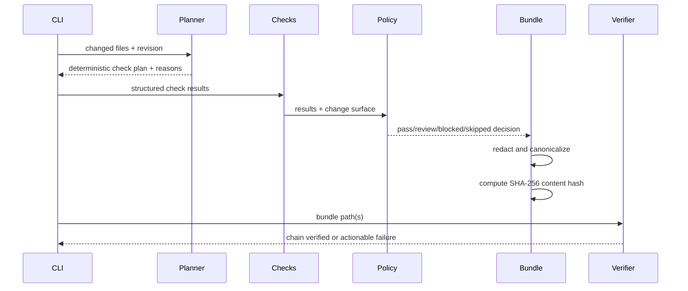

# Architecture

ProofSmith is organized around a small domain core rather than a framework. The core vocabulary is a `VerificationRequest`, a set of `CheckResult` records, a `Policy` decision, and an `EvidenceBundle`. These objects are immutable dataclasses so the same input can be planned, evaluated, serialized, and replayed without hidden state.

## Flow

The current CLI intentionally accepts structured check results instead of spawning arbitrary commands. That keeps the MVP safe and deterministic. Future runners can implement a narrow adapter interface and return evidence records; they should not leak process output directly into a bundle without redaction and size limits.

## Git input boundary

The `git_adapter` module accepts only the textual output of `git diff --numstat`; it never invokes Git or a shell. It validates tab-separated fields, rejects absolute paths, parent traversal, NUL bytes, negative counts, and malformed line counts. Binary files are represented with zero line churn because Git does not provide meaningful line additions for them. This keeps the adapter deterministic and makes it safe to place before the impact planner in local hooks or CI.

## Extension boundaries

A future plugin registry can map check IDs to providers. A sandbox runner can execute bounded commands with explicit allowlists and timeouts. An attestation adapter can sign the canonical unsigned bundle. None of these concerns belongs in the policy or model modules.

## Error flow

Malformed JSON, unknown statuses, missing paths, and filesystem failures return a concise CLI error with exit code 2. A failed policy is not a process crash: it becomes a `blocked` or `review` result and exits successfully when the bundle was produced, leaving CI policy to decide whether the run should fail. Hash mismatch returns exit code 1 because it indicates evidence integrity failure.

## Security invariants

ProofSmith never stores raw evidence before the redaction boundary. Canonical JSON uses sorted keys and compact separators. Hash verification removes only the `content_hash` field before recomputing. Path execution is not part of the MVP, so a caller cannot turn a bundle input into an implicit shell command.
